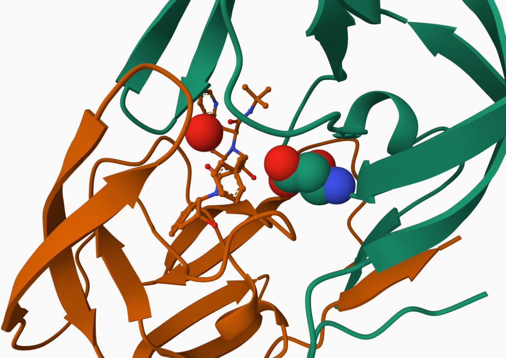

# Class 10: Structural Bioinformatics (PDB)
Darsot (PID: A16294217)

### 1. Introduction RCSB Protein Data Bank

## The PDB Database:

First, lets see what is in the PDB structure - the main repository of
protein structures.

For context, Release 2023_04 of 13-Sep-2023 of UniProtKB/TrEMBL contains
251600, 768 sequence entries. PDB only contains

Retrieve data from https://tinyurl.com/statsPDB

``` r
stats <- read.csv("PDBstats.csv", row.names = 1 )
stats
```

                              X.ray     EM    NMR Multiple.methods Neutron Other
    Protein (only)          158,844 11,759 12,296              197      73    32
    Protein/Oligosaccharide   9,260  2,054     34                8       1     0
    Protein/NA                8,307  3,667    284                7       0     0
    Nucleic acid (only)       2,730    113  1,467               13       3     1
    Other                       164      9     32                0       0     0
    Oligosaccharide (only)       11      0      6                1       0     4
                              Total
    Protein (only)          183,201
    Protein/Oligosaccharide  11,357
    Protein/NA               12,265
    Nucleic acid (only)       4,327
    Other                       205
    Oligosaccharide (only)       22

We must remove the commas from the dataset using `gsub()`:

``` r
x <- stats$X.ray
x
```

    [1] "158,844" "9,260"   "8,307"   "2,730"   "164"     "11"     

``` r
as.numeric(gsub(",", "", x))
```

    [1] 158844   9260   8307   2730    164     11

``` r
rm.comma <- function(x) {
  as.numeric(gsub(",", "", x))

}
```

Use `apply()` to remove commas from all columns in the table.

``` r
apply(stats, 2, "rm.comma")
```

          X.ray    EM   NMR Multiple.methods Neutron Other  Total
    [1,] 158844 11759 12296              197      73    32 183201
    [2,]   9260  2054    34                8       1     0  11357
    [3,]   8307  3667   284                7       0     0  12265
    [4,]   2730   113  1467               13       3     1   4327
    [5,]    164     9    32                0       0     0    205
    [6,]     11     0     6                1       0     4     22

``` r
pdbstats <- apply(stats, 2, "rm.comma")
rownames(pdbstats) <- rownames(stats)
head(pdbstats)
```

                             X.ray    EM   NMR Multiple.methods Neutron Other
    Protein (only)          158844 11759 12296              197      73    32
    Protein/Oligosaccharide   9260  2054    34                8       1     0
    Protein/NA                8307  3667   284                7       0     0
    Nucleic acid (only)       2730   113  1467               13       3     1
    Other                      164     9    32                0       0     0
    Oligosaccharide (only)      11     0     6                1       0     4
                             Total
    Protein (only)          183201
    Protein/Oligosaccharide  11357
    Protein/NA               12265
    Nucleic acid (only)       4327
    Other                      205
    Oligosaccharide (only)      22

## Question 1: What percentage of structures in the PDB are solved by X-Ray and Electron Microscopy.

``` r
totals <- apply(pdbstats, 2, sum)
totals/totals["Total"]
```

               X.ray               EM              NMR Multiple.methods 
        0.8483231383     0.0832730146     0.0667953467     0.0010691797 
             Neutron            Other            Total 
        0.0003642780     0.0001750427     1.0000000000 

``` r
round(totals/totals["Total"] * 100, 2)
```

               X.ray               EM              NMR Multiple.methods 
               84.83             8.33             6.68             0.11 
             Neutron            Other            Total 
                0.04             0.02           100.00 

The percentage of structures in PDB solved by XRay is about 84% and
solved by EM is about 8%.

## Question 2: What proportion of structures in the PDB are protein?

Protein Structures in PDB as a fraction of UniProt sequences

``` r
round(pdbstats[1, "Total"] / sum(pdbstats[, "Total"]) * 100, 2)
```

    [1] 86.67

``` r
round(pdbstats[, "Total"] / sum(pdbstats[, "Total"]) * 100, 2)
```

             Protein (only) Protein/Oligosaccharide              Protein/NA 
                      86.67                    5.37                    5.80 
        Nucleic acid (only)                   Other  Oligosaccharide (only) 
                       2.05                    0.10                    0.01 

The proportion of structures in the pDB that are protein is about 87%.

## Question 3: Type HIV in the PDB website search box on the home page and determine how many HIV-1 protease structures are in the current PDB?

SKIPPED

Protein Fractions

``` r
round( (pdbstats[1, ]))
```

               X.ray               EM              NMR Multiple.methods 
              158844            11759            12296              197 
             Neutron            Other            Total 
                  73               32           183201 

### 2. Visualizing the HIV-1 protease structure

## Question 4: Water molecules normally have 3 atoms. Why do we see just one atom per water molecule in this structure?

This figure is a 2 Angstrom structure but we need a 1 Angstrom structure
to be able to see hydrogen, otherwise it is too small to see.

## Question 5: There is a critical “conserved” water molecule in the binding site. Can you identify this water molecule? What residue number does this water molecule have?

I was able to identify a Water molecule HOH 308.

``` r
library(bio3d)
```

    Warning: package 'bio3d' was built under R version 4.3.2

``` r
pdb <- read.pdb("1hsg")
```

      Note: Accessing on-line PDB file

``` r
pdb
```


     Call:  read.pdb(file = "1hsg")

       Total Models#: 1
         Total Atoms#: 1686,  XYZs#: 5058  Chains#: 2  (values: A B)

         Protein Atoms#: 1514  (residues/Calpha atoms#: 198)
         Nucleic acid Atoms#: 0  (residues/phosphate atoms#: 0)

         Non-protein/nucleic Atoms#: 172  (residues: 128)
         Non-protein/nucleic resid values: [ HOH (127), MK1 (1) ]

       Protein sequence:
          PQITLWQRPLVTIKIGGQLKEALLDTGADDTVLEEMSLPGRWKPKMIGGIGGFIKVRQYD
          QILIEICGHKAIGTVLVGPTPVNIIGRNLLTQIGCTLNFPQITLWQRPLVTIKIGGQLKE
          ALLDTGADDTVLEEMSLPGRWKPKMIGGIGGFIKVRQYDQILIEICGHKAIGTVLVGPTP
          VNIIGRNLLTQIGCTLNF

    + attr: atom, xyz, seqres, helix, sheet,
            calpha, remark, call

``` r
head(pdb$atom)
```

      type eleno elety  alt resid chain resno insert      x      y     z o     b
    1 ATOM     1     N <NA>   PRO     A     1   <NA> 29.361 39.686 5.862 1 38.10
    2 ATOM     2    CA <NA>   PRO     A     1   <NA> 30.307 38.663 5.319 1 40.62
    3 ATOM     3     C <NA>   PRO     A     1   <NA> 29.760 38.071 4.022 1 42.64
    4 ATOM     4     O <NA>   PRO     A     1   <NA> 28.600 38.302 3.676 1 43.40
    5 ATOM     5    CB <NA>   PRO     A     1   <NA> 30.508 37.541 6.342 1 37.87
    6 ATOM     6    CG <NA>   PRO     A     1   <NA> 29.296 37.591 7.162 1 38.40
      segid elesy charge
    1  <NA>     N   <NA>
    2  <NA>     C   <NA>
    3  <NA>     C   <NA>
    4  <NA>     O   <NA>
    5  <NA>     C   <NA>
    6  <NA>     C   <NA>

## Q6: Generate and save a figure clearly showing the two distinct chains of HIV-protease along with the ligand. You might also consider showing the catalytic residues ASP 25 in each chain and the critical water (we recommend “Ball & Stick” for these side-chains). Add this figure to your Quarto document.

Here is a figure of HIP-Pr with the catalytic ASP residues, the MK1
compound and all the important water 308.



## Q7: \[Optional\] As you have hopefully observed HIV protease is a homodimer (i.e. it is composed of two identical chains). With the aid of the graphic display can you identify secondary structure elements that are likely to only form in the dimer rather than the monomer?

### Introduction to BIO3D in R

### Predicting functional motions of a single structure

Lets finish today with a bioinformatics calculation to predict the
functional motions of a PDB structure:

``` r
adk <- read.pdb("6s36")
```

      Note: Accessing on-line PDB file
       PDB has ALT records, taking A only, rm.alt=TRUE

``` r
m <- nma(adk)
```

     Building Hessian...        Done in 0.03 seconds.
     Diagonalizing Hessian...   Done in 0.23 seconds.

``` r
plot(m)
```


``` r
mktrj(m, file="adk_m7.pdb")
```

## 4. Comparative structure analysis of Adenylate Kinase

``` r
# Install packages in the R console NOT your Rmd/Quarto file

#install.packages("bio3d")
#install.packages("devtools")
#install.packages("BiocManager")

#BiocManager::install("msa")
#devtools::install_bitbucket("Grantlab/bio3d-view")
```
