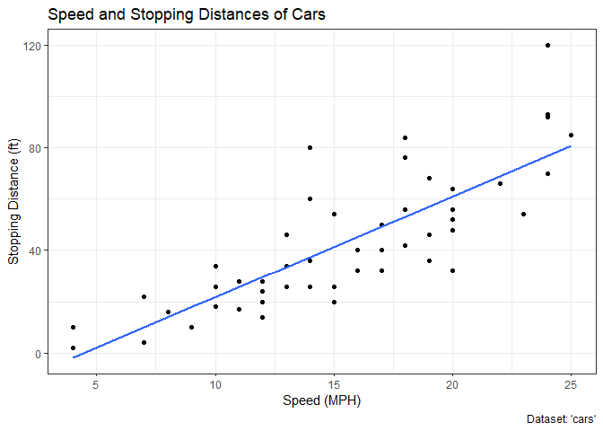
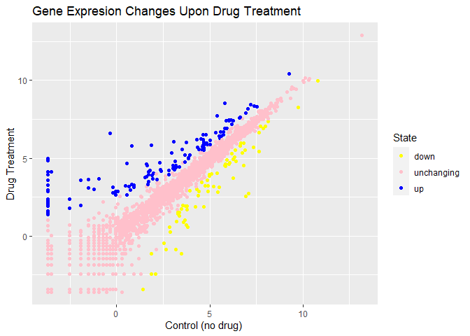

# Class 05 Data Visualization with ggplot2
Darsot (PID: A16294217)

## Using GGPLOT

The ggplot2 package needs to be installed as it does not come with R
“out of the box”

We use the `install.packages()` function to do this.

``` r
head(cars)
```

      speed dist
    1     4    2
    2     4   10
    3     7    4
    4     7   22
    5     8   16
    6     9   10

## 6. Creating Scatter Plots

To use ggplot I need to load it up before I can call any functions in
the package. I do this with the `library()` function.

All ggplot figures have at least 3 things: - data (the stuff we want to
plot) - aesthetic mapping (aes values) - geoms

\#Introduction to Scatter Plots

Scatterplots are used to visualize numeric variables.

``` r
library(ggplot2)
ggplot()
```


This command above is blank because `ggplot()` simply defines the
dataset with an empty base. We must now create layers.

## Specifying a geom layer with `geom_point()`

`geom_point()` is used to define how to visualize the plot. -
`geom_line()` is used for line plot - `geom_bar()` is used for bar
plot - `geom_boxplot()` is used for boxplot

I will used `geom_point()` to add points to the plot.

``` r
ggplot(cars) +
    aes(x=speed, y=dist) + 
    geom_point()
```


\#ggplot is not the only graphing system in R there are lots of others.
There is even “base R” graphics.

`geom_smooth()` is used to add a trend line layer to help show the
relationship between the plot variables.

``` r
ggplot(cars) +
  aes(x=speed, y=dist) +
  geom_point() +
  geom_smooth()
```

    `geom_smooth()` using method = 'loess' and formula = 'y ~ x'


Now we will rid of the shaded region (standard error) by making
`se`=FALSE.

``` r
ggplot(cars) +
  aes(x=speed, y=dist) +
  geom_point() +
  geom_smooth(method="lm", se=FALSE)
```

    `geom_smooth()` using formula = 'y ~ x'


`labs()` function and `theme_bw()` allows us to add labels and a black
and white theme to our plot.

``` r
ggplot(cars) + 
  aes(x=speed, y=dist) +
  geom_point() +
  labs(title="Speed and Stopping Distances of Cars",
       x="Speed (MPH)", 
       y="Stopping Distance (ft)",
       caption="Dataset: 'cars'") +
  geom_smooth(method="lm", se=FALSE) +
  theme_bw()
```

    `geom_smooth()` using formula = 'y ~ x'



## Adding more plot aesthetics through `aes()`

aes is used to map additional variables to plots such as size,
transparency, and color.

``` r
url <- "https://bioboot.github.io/bimm143_S20/class-material/up_down_expression.txt"
genes <- read.delim(url)
head(genes)
```

            Gene Condition1 Condition2      State
    1      A4GNT -3.6808610 -3.4401355 unchanging
    2       AAAS  4.5479580  4.3864126 unchanging
    3      AASDH  3.7190695  3.4787276 unchanging
    4       AATF  5.0784720  5.0151916 unchanging
    5       AATK  0.4711421  0.5598642 unchanging
    6 AB015752.4 -3.6808610 -3.5921390 unchanging

Using the dataset above, we will create a plot with layers.

``` r
ggplot(genes) + 
    aes(x=Condition1, y=Condition2) + 
  geom_point()
```


Now we will specify colors to specific columns.

``` r
p <- ggplot(genes) + 
    aes(x=Condition1, y=Condition2, col=State) +
    geom_point()
p
```


Now I will change the default colors:

``` r
p + scale_colour_manual( values=c("yellow","pink","blue") )
```


Now we will add plot annotations:

``` r
p + scale_colour_manual(values=c("yellow","pink","blue")) +
    labs(title="Gene Expresion Changes Upon Drug Treatment",
         x="Control (no drug) ",
         y="Drug Treatment")
```



## 7. Going Further:

Now we will consider a new dataset: gapminder. We will use the `dplyr`
code to focus on a single year.

``` r
#install.packages("gapminder")
library(gapminder)
```

``` r
# install.packages("dplyr")
library(dplyr)
```

    Warning: package 'dplyr' was built under R version 4.3.2


    Attaching package: 'dplyr'

    The following objects are masked from 'package:stats':

        filter, lag

    The following objects are masked from 'package:base':

        intersect, setdiff, setequal, union

``` r
gapminder_2007 <- gapminder %>% filter(year==2007)
```

``` r
ggplot(gapminder_2007) +
  aes(x=gdpPercap, y=lifeExp) +
  geom_point()
```


``` r
ggplot(gapminder_2007) +
  aes(x=gdpPercap, y=lifeExp) +
  geom_point(alpha=0.5)
```


\#Adding more variables to aes()

``` r
ggplot(gapminder_2007) +
  aes(x=gdpPercap, y=lifeExp, color=continent, size=pop) +
  geom_point(alpha=0.5)
```


``` r
ggplot(gapminder_2007) + 
  aes(x = gdpPercap, y = lifeExp, color = pop) +
  geom_point(alpha=0.8)
```


\#Adjusting Point Size

setting the point size using `size=()` function.

``` r
ggplot(gapminder_2007) + 
  aes(x = gdpPercap, y = lifeExp, size = pop) +
  geom_point(alpha=0.5)
```


To reflect actual populations, we will scale using `scale_size_area()`
function.

``` r
ggplot(gapminder_2007) + 
  geom_point(aes(x = gdpPercap, y = lifeExp,
                 size = pop), alpha=0.5) + 
  scale_size_area(max_size = 15)
```


Now we will use the code learned to product a gapminder scatter plot for
the year 1957.

``` r
library(dplyr)
gapminder_1957 <- gapminder %>% filter(year==1957)
```

``` r
ggplot(gapminder_1957) + 
  aes(x= gdpPercap, y= lifeExp, color=continent, size=pop) + geom_point(alpha=0.7) + 
  scale_size_area(max_size= 10)
```


Now we will include year 2007 with 1957 to see them side-by-side

``` r
gapminder_1957 <- gapminder %>% filter(year==1957 | year==2007)

ggplot(gapminder_1957) + 
  geom_point(aes(x = gdpPercap, y = lifeExp, color=continent,
                 size = pop), alpha=0.7) + 
  scale_size_area(max_size = 10) +
  facet_wrap(~year)
```


