# Class07Lab
Darsot (PID: A16294217)

First, read the file that includes the data for the lab:

``` r
url <- "https://tinyurl.com/UK-foods"
x <- read.csv(url)
x
```

                         X England Wales Scotland N.Ireland
    1               Cheese     105   103      103        66
    2        Carcass_meat      245   227      242       267
    3          Other_meat      685   803      750       586
    4                 Fish     147   160      122        93
    5       Fats_and_oils      193   235      184       209
    6               Sugars     156   175      147       139
    7      Fresh_potatoes      720   874      566      1033
    8           Fresh_Veg      253   265      171       143
    9           Other_Veg      488   570      418       355
    10 Processed_potatoes      198   203      220       187
    11      Processed_Veg      360   365      337       334
    12        Fresh_fruit     1102  1137      957       674
    13            Cereals     1472  1582     1462      1494
    14           Beverages      57    73       53        47
    15        Soft_drinks     1374  1256     1572      1506
    16   Alcoholic_drinks      375   475      458       135
    17      Confectionery       54    64       62        41

\###Question 1: How many rows and columns are in your new data named x?
What R functions could you use to answer this question?

``` r
dim(x)
```

    [1] 17  5

\##Checking your data: Use the `view()` function to see all data in a
new tab. Or use `head()` or `tail()` to preview the first/last 6 rows.

\#Preview the first 6 rows:

``` r
head(x)
```

                   X England Wales Scotland N.Ireland
    1         Cheese     105   103      103        66
    2  Carcass_meat      245   227      242       267
    3    Other_meat      685   803      750       586
    4           Fish     147   160      122        93
    5 Fats_and_oils      193   235      184       209
    6         Sugars     156   175      147       139

\#Fix the code using `rownames()` to rename the first column properly:

``` r
rownames(x) <- x[,1]
x <- x[,-1]
head(x)
```

                   England Wales Scotland N.Ireland
    Cheese             105   103      103        66
    Carcass_meat       245   227      242       267
    Other_meat         685   803      750       586
    Fish               147   160      122        93
    Fats_and_oils      193   235      184       209
    Sugars             156   175      147       139

``` r
dim(x)
```

    [1] 17  4

\#Another approach: x \<- read.csv(url, row.names=1) head(x)

\###Question 2: Which approach to solving the ‘row-names problem’
mentioned above do you prefer and why? Is one approach more robust than
another under certain circumstances?

I would prefer the second approach, re-reading the data file and setting
the row names as the first column. Running the first approach code block
(x \<- x\[,-1\]) multiple times would remove additional columns from the
dataset.

\###Spotting major differences and trends:

``` r
barplot(as.matrix(x), beside=T, col=rainbow(nrow(x)))
```


\###Question3: Changing what optional argument in the above barplot()
function results in the following plot

``` r
barplot(as.matrix(x), beside=F, col=rainbow(nrow(x)))
```


Changing the optional argument `beside` from TRUE to FALSE. False
displays it so that the data is stacked instead of side-by-side.

\###Question5: Generating all pairwise plots may help somewhat. Can you
make sense of the following code and resulting figure? What does it mean
if a given point lies on the diagonal for a given plot?

``` r
pairs(x, col=rainbow(10), pch=16)
```


The above is a scatter plot that represents the relationship between two
pairs in ‘x’. The diagonal represents the variables plotted against
itself, so if there is a dot on the diagonal it means the y-value and
x-value are the same.

\###Question6: What is the main differences between N. Ireland and other
countries of the UK in terms of this data-set?

The main difference between N. Ireland and other countries is that N.
Ireland is more clustered near the 500 mark.

\##PCA to the rescue: `prcomp()` function can be used for PCA
inmplementation.

``` r
pca <- prcomp (t(x))
summary(pca)
```

    Importance of components:
                                PC1      PC2      PC3       PC4
    Standard deviation     324.1502 212.7478 73.87622 3.176e-14
    Proportion of Variance   0.6744   0.2905  0.03503 0.000e+00
    Cumulative Proportion    0.6744   0.9650  1.00000 1.000e+00

\###Question7: Complete the code below to generate a plot of PC1 vs PC2.
The second line adds text labels over the data points.

``` r
plot(pca$x[,1], pca$x[,2], xlab="PC1", ylab="PC2",xlim=c(-300,500))
text(pca$x[,1], pca$x[,2], colnames(x))
```

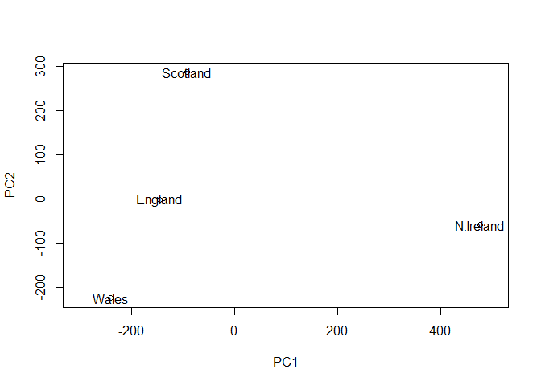

\###Question8: Customize your plot so that the colors of the country
names match the colors in our UK and Ireland map and table at start of
this document.

``` r
country_colors <- c("orange", "pink", "lime green", "light green")
plot(pca$x[,1], pca$x[,2], xlab="PC1", ylab="PC2", xlim=c(-270,500))
text(pca$x[,1], pca$x[,2], colnames(x), col=country_colors)
```

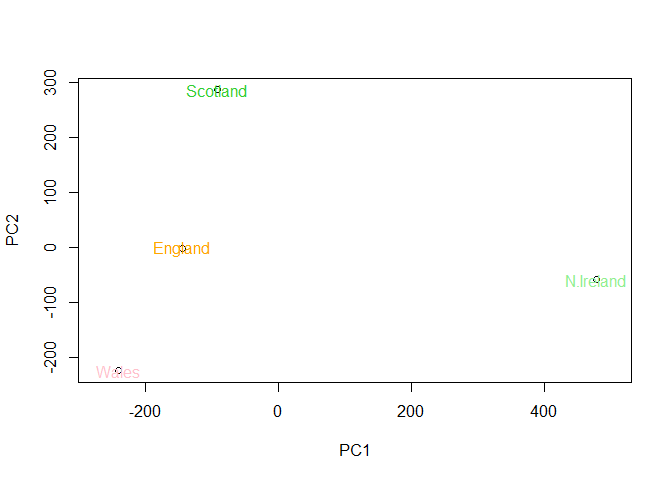

\##Calculating standard deviation:

``` r
v <- round( pca$sdev^2/sum(pca$sdev^2)*100)
v
```

    [1] 67 29  4  0

``` r
z <- summary(pca)
z$importance
```

                                 PC1       PC2      PC3          PC4
    Standard deviation     324.15019 212.74780 73.87622 3.175833e-14
    Proportion of Variance   0.67444   0.29052  0.03503 0.000000e+00
    Cumulative Proportion    0.67444   0.96497  1.00000 1.000000e+00

``` r
barplot(v, xlab="Principal Component", ylab="Percent Variation")
```


\##Digging Deeper(variabele loadings):

``` r
par(mar=c(10, 3, 0.35, 0))
barplot( pca$rotation[,1], las=2 )
```


\###Question9: Generate a similar ‘loadings plot’ for PC2. What two food
groups feature prominantely and what does PC2 maninly tell us about?

``` r
par(mar=c(10, 3, 0.35, 0))
barplot( pca$rotation[,2], las=2 )
```

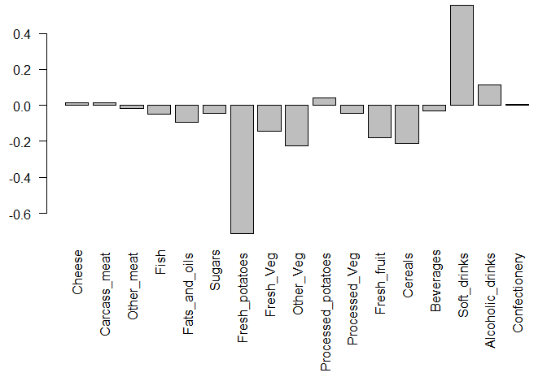

The largest positive loading score is Soft Drinks. The largest negative
score is Fresh potatoes. PC2 mainly tells us about what food groups are
pushing other countries to the right or left side of the plot.

\##Biplots:

``` r
biplot(pca)
```

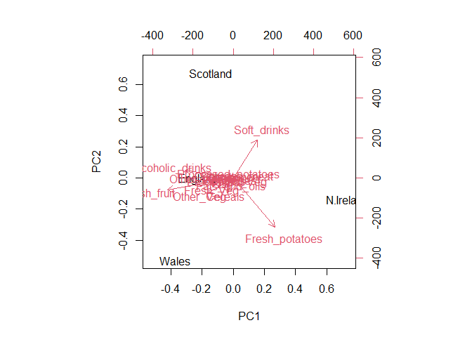

\##PCA of RNA-seq data: Read the data frame for a small RNA-seq count
data set.

``` r
url2 <- "https://tinyurl.com/expression-CSV"
rna.data <- read.csv(url2, row.names=1)
head(rna.data)
```

           wt1 wt2  wt3  wt4 wt5 ko1 ko2 ko3 ko4 ko5
    gene1  439 458  408  429 420  90  88  86  90  93
    gene2  219 200  204  210 187 427 423 434 433 426
    gene3 1006 989 1030 1017 973 252 237 238 226 210
    gene4  783 792  829  856 760 849 856 835 885 894
    gene5  181 249  204  244 225 277 305 272 270 279
    gene6  460 502  491  491 493 612 594 577 618 638

\###Question10: How many genes and samples are in this data set? If the
samples are columns and the genes are rows, there are 6 genes and 10
samples in this set.

\#Consider doing a PCA to better interpret the data:

``` r
#Begin by transposig the data: 

pca <- prcomp(t(rna.data), scale=T)

#Plot 

plot(pca$x[,1], pca$x[,2], xlab="PC1", ylab="PC2")
```

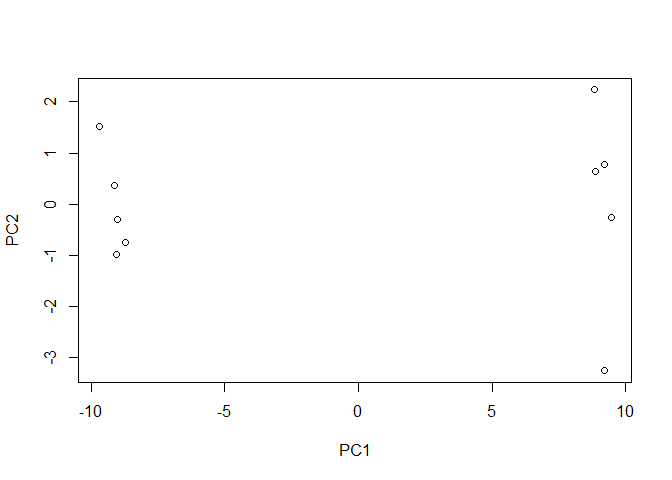

Examine the summary of the pca:

``` r
summary(pca)
```

    Importance of components:
                              PC1    PC2     PC3     PC4     PC5     PC6     PC7
    Standard deviation     9.6237 1.5198 1.05787 1.05203 0.88062 0.82545 0.80111
    Proportion of Variance 0.9262 0.0231 0.01119 0.01107 0.00775 0.00681 0.00642
    Cumulative Proportion  0.9262 0.9493 0.96045 0.97152 0.97928 0.98609 0.99251
                               PC8     PC9      PC10
    Standard deviation     0.62065 0.60342 3.457e-15
    Proportion of Variance 0.00385 0.00364 0.000e+00
    Cumulative Proportion  0.99636 1.00000 1.000e+00

Obtain Bar plot:

``` r
plot(pca, main="Quick scree plot")
```

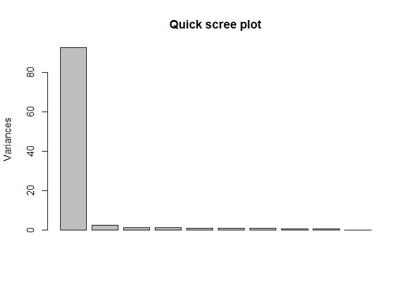

Use `pca$sdev` to calculate variation:

``` r
#Variation: 
pca.var <- pca$sdev^2

#Percent variance: 
pca.var.per <- round(pca.var/sum(pca.var)*100, 1)
pca.var.per
```

     [1] 92.6  2.3  1.1  1.1  0.8  0.7  0.6  0.4  0.4  0.0

Generate Scree plot again using above data:

``` r
barplot(pca.var.per, main="Scree Plot", 
        names.arg = paste0("PC", 1:10),
        xlab="Principal Component", ylab="Percent Variation")
```

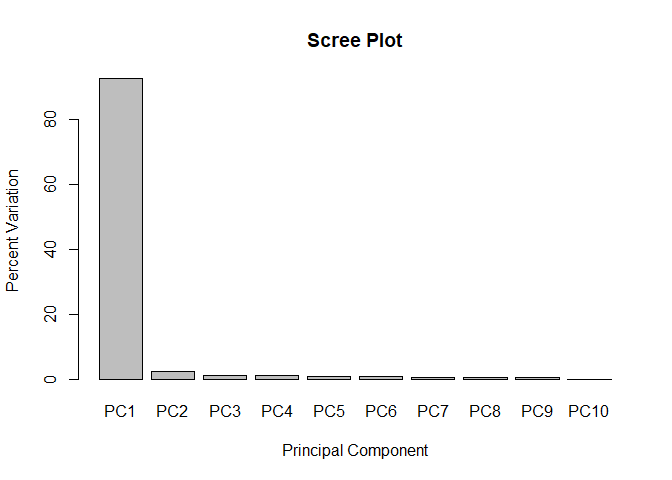

Now to make it colorful:

``` r
#Add vector for colors: 

colvec <- colnames(rna.data)
colvec[grep("wt", colvec)] <- "pink"
colvec[grep("ko", colvec)] <- "green"

plot(pca$x[,1], pca$x[,2], col=colvec, pch=16,
     xlab=paste0("PC1 (", pca.var.per[1], "%)"),
     ylab=paste0("PC2 (", pca.var.per[2], "%)"))

text(pca$x[,1], pca$x[,2], labels = colnames(rna.data), pos=c(rep(4,5), rep(2,5)))
```

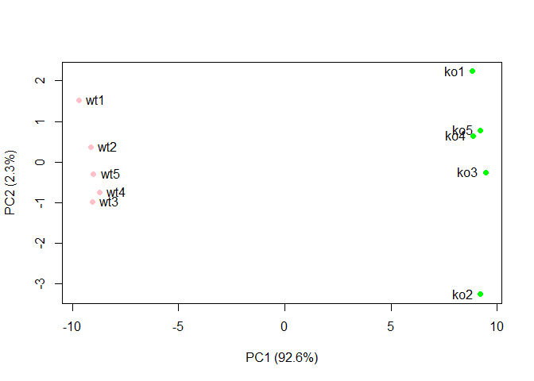

\#Using ggplot:

create data frame for ggplot input with PCA results.

``` r
library(ggplot2)
df <- as.data.frame(pca$x)

ggplot(df) + 
  aes(PC1, PC2) + 
  geom_point()
```

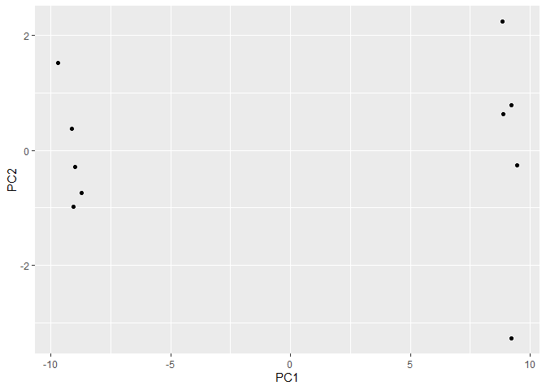

Add conditions:

``` r
df$samples <- colnames(rna.data) 
df$condition <- substr(colnames(rna.data),1,2)

p <- ggplot(df) + 
        aes(PC1, PC2, label=samples, col=condition) + 
        geom_label(show.legend = FALSE)
p
```

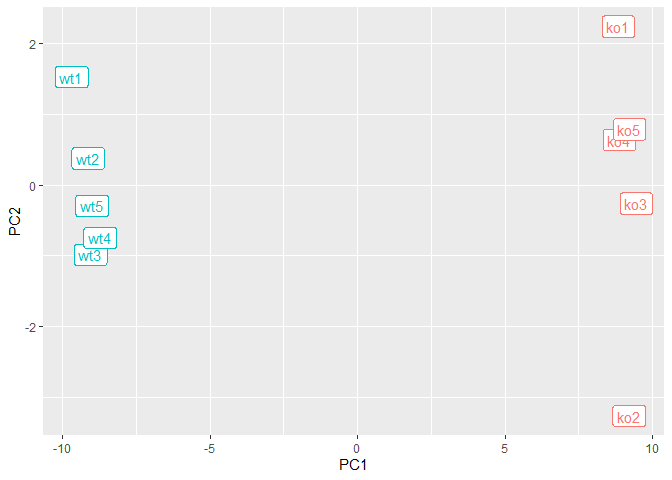

``` r
p + labs(title="PCA of RNA-Seq Data",
       subtitle = "PC1 seperates wild-type from knock-out samples",
       x=paste0("PC1 (", pca.var.per[1], "%)"),
       y=paste0("PC2 (", pca.var.per[2], "%)"),
       caption="Class example data") +
     theme_bw()
```

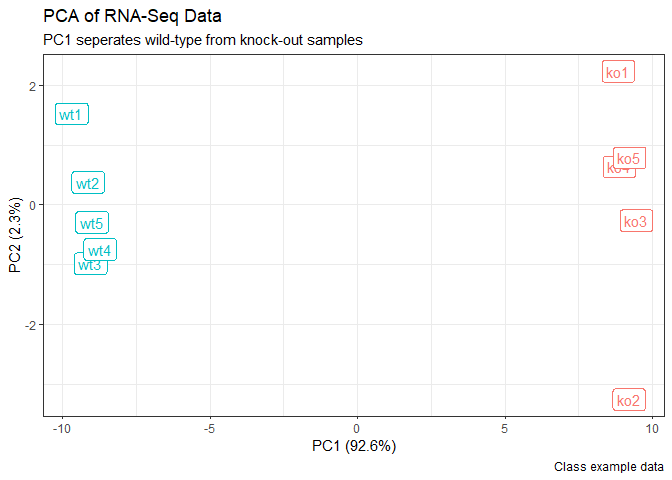
